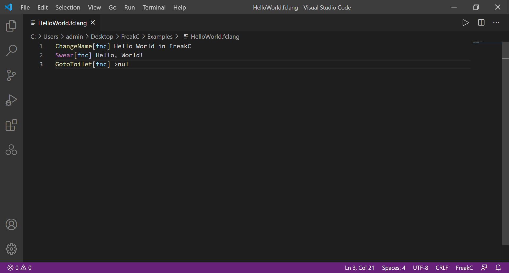
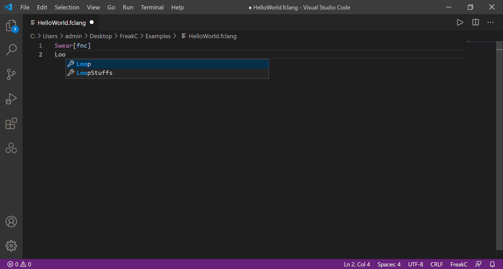

# FreakC README

This is the official language support extension for esoteric programming language FreakC

## Features

### Syntax highlighting

### Autocomplete

Official GitHub repository : (https://github.com/nguyenphuminh/FreakC)

## Release Notes

### 1.0.0

-Initial release
